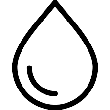

<html>
	<head>
		
	</head>
	<body>
	

		<h1>
 Bills Payment 
</h1>
		<h2>
 Payment catagories 
</h2>
		<h3>
 Recharge 
</h3>
		

			

				
				
 DTH/Cable TV 

			

			

				
				
 Google play 

			

			

				
				
 FAST TAG 

			

		
             
		<h3>
 Utility Bills
</h3>
		

			

				
				
 Electricity 

			

			

				
				
 Broadband/Landline 

			

			

				
				
 Piped GAS 

			

			

				
				
 Water

			

			

				
				
 Education 

			

			
			
		

		
